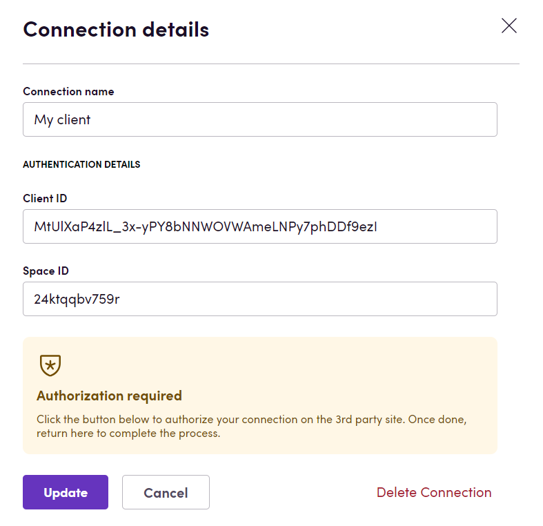
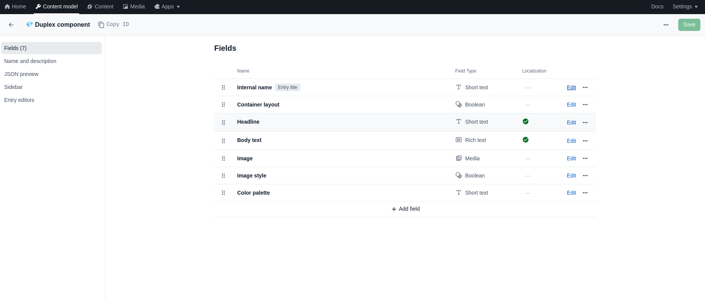
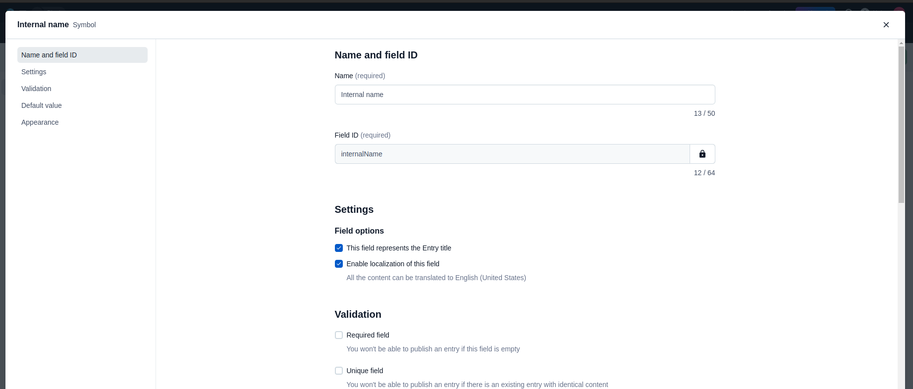
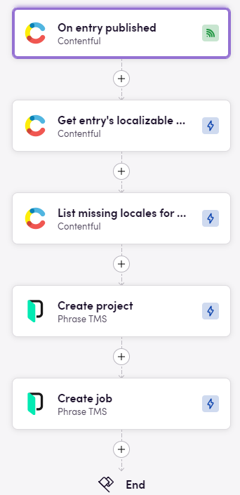

# Blackbird.io Contentful

Blackbird is the new automation backbone for the language technology industry. Blackbird provides enterprise-scale automation and orchestration with a simple no-code/low-code platform. Blackbird enables ambitious organizations to identify, vet and automate as many processes as possible. Not just localization workflows, but any business and IT process. This repository represents an application that is deployable on Blackbird and usable inside the workflow editor.

## Introduction

<!-- begin docs -->

Contentful is a headless CMS that empowers businesses to create, manage, and deliver digital content across various platforms and devices. It is primarily used for efficient organization and distribution of content, offering features like content modeling, versioning and API-driven content delivery.

## Before setting up

Before you can connect you need to make sure that:

- You have a Contentful account with a space you want to connect to.
- Your Contentful account has the right permissions in the space. You can read more about space roles and permissions [here](https://www.contentful.com/help/space-roles-and-permissions/).
- You have your own [OAuth application](https://app.contentful.com/account/profile/developers/applications) created.

## Create OAuth application

1. Navigate to [OAuth applications](https://app.contentful.com/account/profile/developers/applications) page and click _New Application_.
2. Enter application _Name_ and _Description_. In _Redirect URI_ field specify `https://{domain_name}/oauthImplicitGrant` (replace `{domain_name}` with a domain name of site where you are trying to setup a connection. For example: `de-1.blackbird.io` or `fly.blackbird.io`)
3. Under _Redirect URI_ select _Content management manage_.
4. Click _Create Application_.
5. After the application is created, _Client ID_ is generated. _Client ID_ is required to connect to Contentful via Blackbird.

## Connecting

1. Navigate to apps and search for Contentful. If you cannot find Contentful then click _Add App_ in the top right corner, select Contentful and add the app to your Blackbird environment.
2. Click _Add Connection_.
3. Name your connection for future reference e.g. 'My client'.
4. Fill in the _Client ID_ obtained earlier.
5. Fill in the _Space ID_ of the Contentful space you want to connect to. To find space ID follow [this instructions](https://www.contentful.com/help/find-space-id/).
6. Click _Authorize connection_.
7. Follow the instructions that Contentful gives you, authorizing Blackbird.io to act on your behalf.
8. When you return to Blackbird, confirm that the connection has appeared and the status is _Connected_.



## Working with translations

Follow [this guide](https://www.contentful.com/help/working-with-translations/) to be able to work with translations in Contentful.

## Actions

### Entries

- **Get entry's text/rich text field** returns the content of short text, long text or rich text field of the entry as a string.
- **Get entry's text/rich text field as HTML file** returns the content of short text, long text or rich text field of the entry as an HTML file.
- **Set entry's text/rich text field** sets the content of short text, long text or rich text field of the entry from a string.
- **Set entry's text/rich text field from HTML file** sets the content of short text, long text or rich text field of the entry from an HTML file. For short/long text only the text extracted from the file is put in the field. For rich text all HTML structure is preserved.
- **Get entry's number field** returns the entry's number field value.
- **Set entry's number field** sets the entry's number field value.
- **Get entry's boolean field** returns the entry's boolean field value.
- **Set entry's boolean field** sets the entry's boolean field value.
- **Get entry's media content** returns the identifier of the asset attached to the entry's media field.
- **Set entry's media field** sets the entry's media field with the specified asset.
- **List entries** returns a list of entries' identifiers that have the specified content model.
- **Get entry** Get details of a specific entry
- **Add new entry** creates a new entry with the specified content model.
- **Delete entry**.
- **Publish entry**.
- **Unpublish entry**.
- **List missing locales for a field** returns a list of missing translations for the specified field.
- **List missing locales for entry** returns a list of missing translations for the specified entry.
- **Get entry's localizable fields as HTML file** returns all localizable fields of the specified entry as HTML file.
- **Set entry's localizable fields from HTML file**.

**Get entry's localizable fields as HTML file** and **Set entry's localizable fields from HTML file** are intended to be used together in translation flow: you can retrieve an entry's localizable fields as HTML file, put it into TMS, then retrieve a translated HTML file and put it back into Contentful's entry. **Set entry's localizable fields from HTML file** expects the same HTML structure as the structure of the file retrieved with **Get entry's localizable fields as HTML file**.

**Important note**: make sure your entry has fields with **localization enabled**. You have to explicitly set this property on each field (see images below).




### Assets

- **Get asset** returns title, description and a file attached to the asset.
- **Create and upload asset**.
- **Update asset file**.
- **Delete asset** Delete specified asset.
- **Publish asset**.
- **Unpublish asset**.
- **Is asset locale present** checks if specified file translation is present for the asset.
- **List missing locales for an asset** returns a list of all missing translations for the asset.
- **Add asset tag** Add a new tag to the specified asset
- **Remove asset tag** Remove a specific tag from the asset

### Content models

- **List all content models** returns all content models available in space.
- **Get content model** Get details of a specific content model.

### Tag
- **List tags** List all content tags in a space
- **Create tag** Create a new content tag
- **Get tag** Get details of a specific tag
- **Delete tag** Delete specific content tag
- **Add tag to entry** Add specific tag to an entry
- **Remove tag from entry** Remove specific tag from an entry

## Events

- **On entry published** and **On asset published** are the most useful events. They are triggered when any entry/asset is published and could be the perfect trigger for sending the entry/asset for translation based on the missing translations (see example).
Other events:
### Other events:
- **On entry created**
- **On entry saved**
- **On entry auto saved**
- **On entry unpublished**
- **On entry archived**
- **On entry unarchived**
- **On entry deleted**
- **On asset created**
- **On asset saved**
- **On asset auto saved**
- **On asset unpublished**
- **On asset archived**
- **On asset unarchived**
- **On asset deleted**

## Example



In this example, whenever an entry is published we retrieve the localizable fields as an HTML file and fetch the missing translations. Then we create a new Phrase project with the missing locales as the target languages and create a new Phrase job for the file.

## HTML features

We add metadata to the HTML file to include `Entry ID` and `Field ID`. This metadata is used to update the entry content from the HTML file. These tags are used to identify the content in the `Contentful`, eliminating the need to store IDs elsewhere.

Example of how we include metadata in the HTML file:

```html
<html>
<head>
    <meta name="blackbird-entry-id" content="example-entry-id">
    <meta name="blackbird-field-id" content="example-field-id">
</head>
<body>
    <p>Toothbrush</p>
</body>
</html>
```

## Missing features

Most content related actions exist. However, in the future we can add actions for more field types. Let us know if you're interested!

If you want to have a more convenient experience managing your Contentful with Blackbird, consider cloning this app and modifying it so it aligns with your configuration.

## Feedback

Feedback to our implementation of Contentful is always very welcome. Reach out to us using the established channels or create an issue.

<!-- end docs -->
